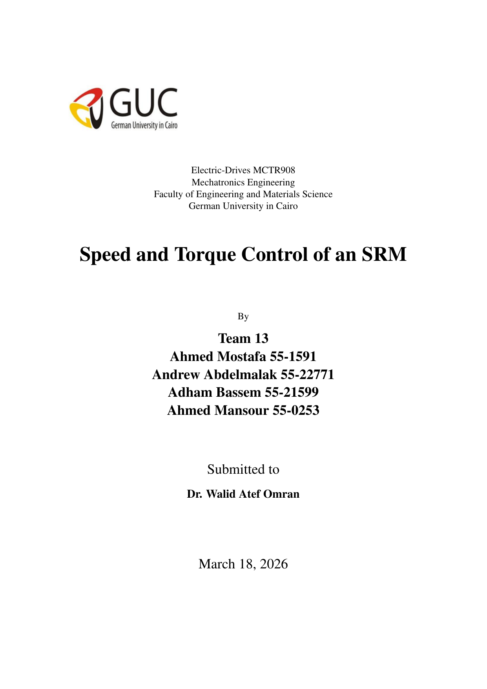

# SRM Speed and Torque Control - Milestone 1 (Theory Baseline)

This repository stages the electric-drives project deliverables for SRM speed/torque control.
It contains normalized milestone-aware report filenames, extracted text, and reproducibility
instructions for the IEEE-style paper source.

> **Paper:** The milestone report is available in `docs/reports/m1_srm_theoretical_background_report.pdf`.

## Visual Highlights

<p align="center">
	
</p>
<p align="center"><em>Figure 1. Cover-page preview of the IEEE-style milestone report for SRM speed and torque control.</em></p>

## Team

| Name | Student ID |
|------|------------|
| Ahmed Mostafa | 55-1591 |
| Andrew Abdelmalak | 55-22771 |
| Adham Bassem | 55-21599 |
| Ahmed Mansour | 55-0253 |

**Course**: MCTR908 - Electric Drives  
**Institution**: German University in Cairo (GUC)

---

## Repository Structure

```
srm-speed-torque-control/
├── docs/
│   └── reports/
│       ├── m1_team13_cover_sheet.pdf
│       └── m1_srm_theoretical_background_report.pdf
├── assets/
│   └── figures/
│       ├── m1_cover_sheet_preview.png
│       └── m1_report_preview.png
├── README.md
└── LICENSE
```

---

## Scope of This Milestone

- Theoretical SRM modeling and control background.
- Literature-backed control architecture (PI speed loop + current loop + TSF concepts).
- No executable MATLAB/Simulink model files were included in the source evidence.

---

## Next Milestone Recommendations

1. Add Simulink model files (`.slx`) for nonlinear SRM dynamics.
2. Add MATLAB scripts for controller tuning and TSF comparisons.
3. Include plots for speed response, torque ripple, and phase current waveforms.
4. Add parameter sheets for machine constants (`R`, `J`, `B`, lookup-table grids).

---

## License

This repository is licensed under the MIT License. See `LICENSE`.
