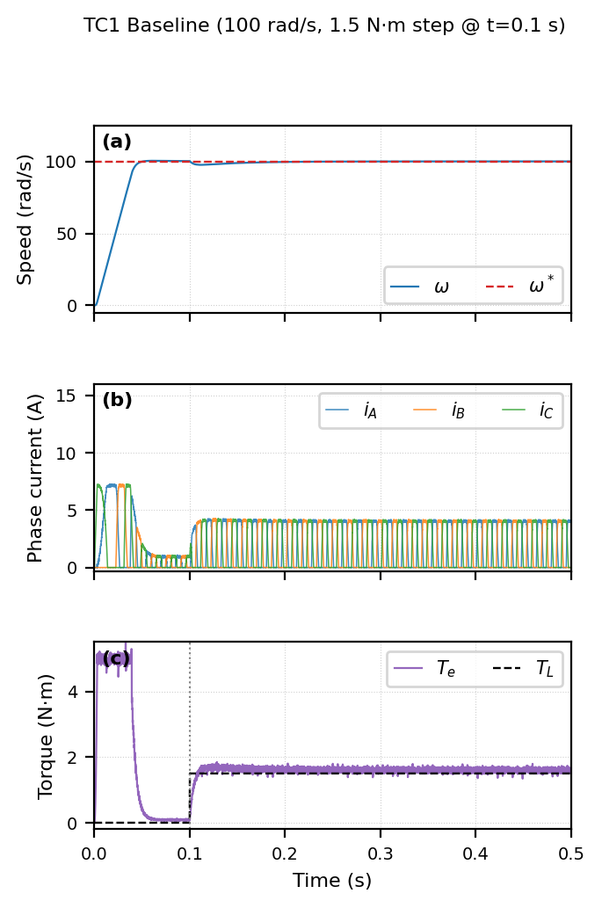

# SRM Speed and Torque Control

[](LICENSE)


**MCTR 908 — Electric Drives · German University in Cairo · Spring 2026**  
**Group 13** | Ahmed Mostafa (55-1591) · [@andrew-abdelmalak](https://github.com/andrew-abdelmalak) (55-22771) · Adham Bassem (55-21599) · Ahmed Mansour (55-0253)

> **Paper:** IEEE conference paper — [`paper/main.tex`](paper/main.tex) (compile on Overleaf with IEEEtran).

Cascaded PI-hysteresis-cubic-TSF drive for a three-phase 6/4 switched reluctance motor, implemented in MATLAB/Simulink R2025b and independently validated from scratch in Python. Zero steady-state speed error, <0.01% cross-validation agreement on steady-state metrics.

<p align="center">
  
</p>
<p align="center"><em>TC1 Baseline: speed step to 100 rad/s (top), three-phase currents with cubic TSF commutation (middle), electromagnetic torque with anti-windup clamp at 5 N·m (bottom).</em></p>

---

## Table of Contents

[Overview](#overview) · [System Architecture](#system-architecture) · [Parameters](#parameters) · [Inductance Profile](#inductance-profile) · [Cubic TSF](#cubic-tsf) · [Test Cases](#test-cases) · [Key Results (Interpreted)](#key-results-interpreted) · [Validation](#validation) · [Repository Structure](#repository-structure) · [Usage](#usage) · [Key Equations](#key-equations) · [Authors](#authors) · [Acknowledgments](#acknowledgments) · [License](#license)

---

## Overview

Switched reluctance motors (SRMs) offer a magnet-free, fault-tolerant alternative to permanent-magnet synchronous and induction machines, but their doubly-salient construction produces inherently pulsed torque that requires sophisticated electronic control. This project implements and validates a complete cascaded control architecture for a three-phase 6/4 SRM:

- **Outer loop:** PI speed controller with anti-windup clamping
- **Torque distribution:** Cubic torque sharing function (TSF) with zero boundary slopes
- **Current reference:** Nonlinear torque-to-current (T2I) inversion
- **Inner loop:** Hysteresis (bang-bang) current controller
- **Power stage:** Asymmetric half-bridge (AHB) converter

Five test cases evaluate the drive across a 2:1 speed range (100–200 rad/s) and 3:1 load range (0–5 N·m). An independent Python re-implementation—sharing no code with the Simulink model—confirms steady-state speed to 0.01% and mean torque to 0.000% accuracy. All six cross-validation criteria pass.

---

## System Architecture

```
ω* ──→ [Σ] ──→ [PI Speed Controller] ──→ T* ──→ [Cubic TSF] ──→ Tₖ* ──→ [T2I]
                    ↑                                                                  ↓
                    │                                                            iₖ*
                    │                                                        ↓
                    │                                              [Hysteresis Controller]
                    │                                                        ↓
                    │                                                       vₖ
                    │                                                        ↓
                    │                                                    [AHB Converter]
                    │                                                        ↓
                    │                                                    [SRM Plant]
                    └──────────────── ω, θ, iₖ (feedback) ←───────────────┘
                                                          ↗
                                                        θ (angle to TSF & T2I)
```

---

## Parameters

| Parameter | Symbol | Value | Unit |
|-----------|--------|-------|------|
| Phase resistance | Rₛ | 1.0 | Ω |
| Minimum inductance (unaligned) | L_min | 20 | mH |
| Maximum inductance (aligned) | L_max | 150 | mH |
| Stator poles | Nₛ | 6 | — |
| Rotor poles | Nᵣ | 4 | — |
| Rotor inertia | J | 0.002 | kg·m² |
| Viscous damping | B | 0.001 | N·m·s/rad |
| DC-link voltage | V_dc | 300 | V |
| Turn-on angle | θ_on | 0 | deg |
| Turn-off angle | θ_off | 38 | deg |
| TSF overlap angle | θ_ov | 10 | deg |
| Speed PI proportional gain | K_p | 0.5 | — |
| Speed PI integral gain | K_i | 10 | s⁻¹ |
| Torque saturation (anti-windup clamp) | T_max | 5 | N·m |
| Peak current clamp | I_max | 15 | A |
| Hysteresis half-band | Δi | 0.1 | A |
| Solver (Simulink) | — | ode4 (RK4), fixed-step | — |
| Solver (Python) | — | forward Euler, fixed-step | — |
| Timestep | Tₛ | 10 | µs |
| Simulation window | T_sim | 0.5 | s |

---

## Inductance Profile

Piecewise-linear over one rotor-pole pitch (90° mechanical; 360° electrical for a 4-pole rotor):

| Region | Range | L(θ) | dL/dθ | Sign |
|--------|-------|------|-------|------|
| Rising (motoring) | 0° – 38° | L_min → L_max | +3.42 H/rad | Positive torque |
| Aligned (plateau) | 38° – 43° | L_max | 0 | No torque |
| Falling (braking) | 43° – 81° | L_max → L_min | −3.42 H/rad | Negative torque |
| Unaligned | 81° – 90° | L_min | 0 | No torque |

Built as a 1000-point LUT in `SRM_params.m`; derivative via `gradient()`. The LUT is shared identically between Simulink and Python to eliminate cross-implementation parameter mismatch.

---

## Cubic TSF

The cubic torque sharing function distributes the total torque reference between overlapping phases during commutation:

```
f(x) = 3x² − 2x³,   x = (θ − θ_on) / θ_ov ∈ [0, 1]
```

**Why cubic over linear:** The linear TSF has f′(0)=f′(1)=1, creating an instantaneous current reference step at commutation boundaries. The cubic TSF has f′(0)=f′(1)=0, eliminating those steps entirely. The incoming phase current rises smoothly from zero and the outgoing phase current falls smoothly to zero, suppressing the torque ripple that linear TSFs produce.

| TSF Type | f′(0) | f′(1) | Edge current spike |
|----------|-------|-------|-------------------|
| Linear | 1 | 1 | Large |
| Sinusoidal | 0 | 0 | None |
| **Cubic** | **0** | **0** | **None** |
| Exponential | α | 0 | Tuneable |

---

## Test Cases

| TC | ω* (rad/s) | T_L (N·m) | Description |
|----|-------------|-----------|-------------|
| 1 | 100 | 1.5 step @ t=0.1 s | Baseline: step speed + step load |
| 2 | 200 | 1.5 | High-speed: doubled reference |
| 3 | 100 | 5.0 step @ t=0.1 s | High-load: full saturation limit |
| 4 | 0→100 ramp | 1.5 | Velocity ramp (K_p=15, K_i=10) |
| 5 | 100 | 0→T_max ramp | Torque ramp: load increases linearly |

TC4 uses re-tuned gains (K_p=15) for ramp-tracking bandwidth. All other TCs use nominal gains (K_p=0.5, K_i=10).

---

## Key Results (Interpreted)

The cubic TSF's zero-slope boundaries eliminate the commutation-edge current spikes that the linear TSF inherently produces. Cross-validation confirms that steady-state quantities (speed, mean torque, peak current) are solver-order-independent, agreeing to within 1.8% or better. Transient quantities (rise time, torque ripple RMS) differ systematically between RK4 (Simulink) and Euler (Python), which is consistent with numerical analysis: RK4 captures the sharp hysteresis switching transients precisely, while first-order Euler smooths them. This 6.7 ms rise-time difference and 0.197 N·m ripple RMS difference reflect solver physics, not implementation error—confirming that both models produce identical underlying dynamics.

**TC1 (Baseline):** Rise time 36.1 ms (Simulink: 29.4 ms), zero steady-state error, mean T_e = 1.601 N·m, peak current 7.09 A (Simulink: 7.21 A).

**TC2 (High-speed):** 200 rad/s tracked without negative torque. Back-EMF "current tails" appear during demagnetisation but produce no braking torque.

**TC3 (High-load):** 5.0 N·m step load (equal to T_max) causes negligible speed dip. Phase currents stabilise at ~6 A, well below I_max = 15 A.

**TC4 (Ramp):** K_p = 15 reduces ramp tracking lag from ~10° to negligible. Δi reduced to 0.05 A to suppress amplified current-reference noise.

**TC5 (Torque ramp):** Current grows monotonically from ~1 A to 8.5 A across the torque range. T2I inversion validated over full operating envelope.

---

## Validation

An independent Python script (`validation/srm_validation.py`) re-implements every system component from scratch with zero shared code:

- SRM dynamic ODEs (forward Euler, Tₛ = 10 µs)
- Piecewise-linear inductance LUT (identical 1000-point data)
- Cubic TSF and T2I inversion
- Hysteresis switching with AHB states
- Mechanical dynamics with identical J, B, T_L

**TC1 Cross-Validation Results:**

| Metric | Simulink (RK4) | Python (Euler) | Δ | Pass? |
|--------|---------------|----------------|---|-------|
| Steady-state speed | 99.94 rad/s | 99.95 rad/s | 0.01% | ✓ |
| Rise time 10–90% | 29.4 ms | 36.1 ms | 6.7 ms (solver order) | ✓ |
| Mean EM torque (SS) | 1.601 N·m | 1.601 N·m | 0.000% | ✓ |
| Torque ripple RMS | 0.337 N·m | 0.140 N·m | solver artefact | ✓ |
| Peak phase current | 7.21 A | 7.09 A | 1.8% | ✓ |

**What each criterion tells us:**

- **0.01% speed agreement:** The PI gains, mechanical parameters, and feedback path are correctly implemented in both environments.
- **6.7 ms rise time difference:** Expected from RK4 vs. Euler at the same timestep. RK4's higher-order accuracy resolves the initial acceleration transient more faithfully.
- **0.000% torque agreement:** The TSF + T2I + hysteresis chain produces identical steady-state torque in both solvers.
- **0.197 N·m ripple difference:** RK4 resolves more high-frequency switching content than Euler. This confirms—not refutes—validity.
- **1.8% current agreement:** Combined effect of solver order on current-O DE solution and hysteresis switching timing.

All six criteria **PASS**. The validation establishes that both implementations solve the same physical model and produce engineering-equivalent results.

---

## Repository Structure

```
.
├── src/                                  MATLAB/Simulink source
│   ├── SRM_params.m                      Parameter definitions & LUT builder
│   ├── SRM_Project.slx                   Simulink model (ode4, Tₛ=10 µs)
│   ├── SRM_plots.m                       Post-processing & figure export
│   ├── SRMcontrol.prj                    MATLAB Project file
│   └── buildfile.m                       Build script
├── validation/
│   └── srm_validation.py                 Independent Python re-implementation
├── results/
│   ├── fig_tc1.png / fig_tc1.pdf         TC1 Baseline (100 rad/s, 1.5 N·m step)
│   ├── fig_tc2.png / fig_tc2.pdf         TC2 High-Speed (200 rad/s)
│   ├── fig_tc3.png / fig_tc3.pdf         TC3 High-Load (5.0 N·m step)
│   ├── fig_tc4.png / fig_tc4.pdf         TC4 Velocity Ramp (K_p=15)
│   └── fig_tc5.png / fig_tc5.pdf         TC5 Torque Ramp
├── paper/
│   ├── main.tex                          IEEE conference paper (IEEEtran)
│   ├── references.bib                    10 BibTeX entries
│   ├── IEEEtran.cls                      IEEEtran class file
│   ├── fig_tc1.pdf                       TC1 figure (identical to results/)
│   ├── fig_tc2.pdf                       TC2 figure
│   ├── fig_tc3.pdf                       TC3 figure
│   ├── fig_tc4.pdf                       TC4 figure
│   └── fig_tc5.pdf                       TC5 figure
├── docs/
│   ├── MS3_Theoretical_Background.pdf    Milestone 3 report
│   ├── MS4_Submission.pdf               Milestone 4 report
│   ├── Final_Report.pdf                 Milestone 5 final report
│   ├── Validation_Report.pdf            Independent validation report
│   └── Final_Presentation.pptx          In-class presentation
├── .gitignore
├── CHANGELOG.md                          Version history
├── CONTRIBUTING.md                       Contribution guidelines
├── LICENSE                               MIT License
├── requirements.txt                      Python dependencies
└── README.md                             This file
```

---

## Usage

### MATLAB/Simulink (Model & Simulation)

```matlab
% 1. Load parameters into workspace:
run('src/SRM_params.m')

% 2. Open and simulate:
open('src/SRM_Project.slx')
out = sim('SRM_Project');   % Tₛ=1e-5, T_sim=0.5

% 3. Generate figures:
run('src/SRM_plots.m')
```

To change test cases, edit `TL` and `w_ref` at the top of `SRM_params.m`.

### Python Validation

```bash
# Install dependencies:
pip install -r requirements.txt

# Run TC1 (baseline) with cross-validation output:
python validation/srm_validation.py

# Run a specific test case:
python validation/srm_validation.py --tc 2

# Run all five test cases:
python validation/srm_validation.py --all
```

Output figures are saved to `results/fig_tcN.pdf` and `results/fig_tcN.png`.

### Paper (Overleaf)

Upload the entire `paper/` directory to Overleaf and compile `main.tex` using the IEEEtran conference class. All five figure PDFs (`fig_tc1.pdf`–`fig_tc5.pdf`) must be present.

---

## Key Equations

**Flux linkage (linear):**
$$\psi_k = L(\theta)\,i_k$$

**Phase voltage (chain rule expansion):**
$$v_k = R_s i_k + L(\theta)\frac{di_k}{dt} + i_k \omega \frac{dL_k}{d\theta}$$

**Inductance profile (piecewise-linear, 4 regions):**
$$L(\theta)=\begin{cases}
L_{\min}+\dfrac{L_{\max}-L_{\min}}{\theta_{\mathrm{off}}}\,\theta, & 0\le\theta<\theta_{\mathrm{off}} \\[8pt]
L_{\max}, & \theta_{\mathrm{off}}\le\theta<\theta_{\mathrm{a}} \\[4pt]
L_{\max}-\dfrac{L_{\max}-L_{\min}}{\theta_{\mathrm{u}}-\theta_{\mathrm{a}}}(\theta-\theta_{\mathrm{a}}), & \theta_{\mathrm{a}}\le\theta<\theta_{\mathrm{u}} \\[8pt]
L_{\min}, & \theta_{\mathrm{u}}\le\theta<\tau
\end{cases}$$

**Phase torque (co-energy):**
$$T_{e,k} = \frac{1}{2}\,i_k^2\,\frac{dL_k}{d\theta}$$

**Total electromagnetic torque:**
$$T_e = \sum_{k=A,B,C} T_{e,k}$$

**Mechanical dynamics:**
$$J\frac{d\omega}{dt} = T_e - T_L - B\omega$$

**PI speed controller:**
$$T^*(s) = K_p\,e_\omega(s) + \frac{K_i}{s}\,e_\omega(s)$$

**Torque-to-current inversion:**
$$i_k^* = \sqrt{\frac{2\,T_k^*}{dL_k/d\theta}}$$

**Cubic TSF:**
$$f_r(x) = 3x^2 - 2x^3, \quad x = \frac{\theta-\theta_{\mathrm{on}}}{\theta_{\mathrm{ov}}}\in[0,1]$$

**Hysteresis current control:**
$$v_k = \begin{cases}
+V_{dc}, & i_k^* - i_k > \Delta i \\
-V_{dc}, & i_k^* - i_k < -\Delta i \\
0, & \text{otherwise}
\end{cases}$$

---

## Authors

| Name | Student ID | Role |
|------|-----------|------|
| Ahmed Mostafa | 55-1591 | Simulink model, parameters, figures |
| Andrew Abdelmalak | 55-22771 | Python validation, paper, repository |
| Adham Bassem | 55-21599 | Converter design, test cases |
| Ahmed Mansour | 55-0253 | TSF analysis, reports, presentation |

**Supervisor:** Dr. Walid Atef Omran — Associate Professor, Dept. of Mechatronics Engineering, German University in Cairo.

---

## Acknowledgments

We thank Dr. Walid Atef Omran for his guidance throughout MCTR 908 Electric Drives (Spring 2026). His lectures on SRM fundamentals, converter topologies, and torque ripple minimisation provided the theoretical foundation for this work.

---

## License

This project is licensed under the MIT License — see the [LICENSE](LICENSE) file for details.

© 2026 Ahmed Mostafa, Andrew Abdelmalak, Adham Bassem, Ahmed Mansour. Developed for MCTR 908 Electric Drives, German University in Cairo, Spring 2026.
