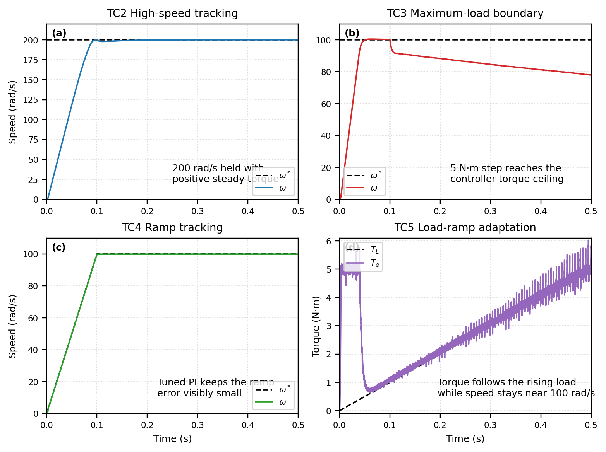
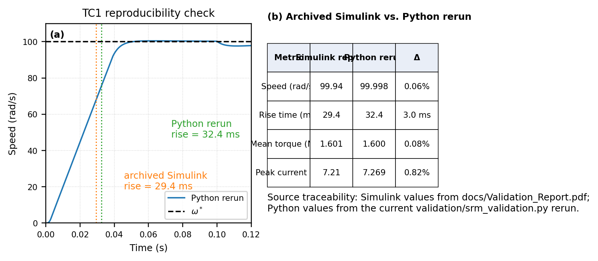

# SRM Speed and Torque Control

[](LICENSE)


[](docs/SRM_Speed_Torque_Control_Paper.pdf)

**MCTR 908 - Electric Drives, German University in Cairo, Spring 2026**  
**Group 13**: Ahmed Mostafa (55-1591), [Andrew Abdelmalak](https://github.com/andrew-abdelmalak) (55-22771), Adham Bassem (55-21599), Ahmed Mansour (55-0253)

**Read first:** [Final paper PDF](docs/SRM_Speed_Torque_Control_Paper.pdf) | [LaTeX source](paper/main.tex) | [Python validation mirror](validation/srm_validation.py)

This repository is the final, traceable version of our switched reluctance motor project.
It documents a full cascaded PI-TSF-T2I-hysteresis drive for a three-phase 6/4 SRM, explains why the cubic torque sharing function matters physically, shows how the controller behaves across the operating envelope, and checks reproducibility with an independent Python re-implementation.

<p align="center">
  
</p>
<p align="center"><em>Operating-envelope summary: high-speed tracking, maximum-load boundary behavior, ramp tracking, and torque adaptation are shown as four different questions instead of four near-duplicate waveform dumps.</em></p>

## What Was Built

- Outer-loop PI speed controller with torque clamp anti-windup.
- Cubic torque sharing function that distributes total torque demand across the three phases.
- Nonlinear torque-to-current inversion for per-phase current references.
- Hysteresis current controller driving an asymmetric half-bridge converter.
- MATLAB/Simulink plant model for the 6/4 SRM and an independent Python mirror for reproducibility checks.

## Why The Cubic TSF Matters

The key control choice in this project is the cubic torque sharing function

```text
f(x) = 3x^2 - 2x^3
```

Its value is physical, not cosmetic.
Unlike a linear sharing law, the cubic TSF has zero slope at both commutation boundaries, so the incoming phase current starts from zero slope and the outgoing phase current decays to zero slope.
That removes the reference step the hysteresis controller would otherwise have to chase at phase handover, which is why the current and torque transitions look smooth instead of kicked.

## Key Findings

| Claim | Evidence | Why it matters |
|---|---|---|
| Full cascaded drive was implemented | MATLAB/Simulink model plus archived reports and current Python mirror are all included in the repo. | The project is more than a set of plots; the full controller stack is present and inspectable. |
| Baseline case is well regulated | TC1 rerun reaches 100 rad/s in 32.4 ms, settles to 99.998 rad/s, and produces 1.600 N.m mean steady-state torque. | The speed loop rejects the nominal 1.5 N.m load after startup saturation clears. |
| High-speed operation stays in motoring mode | TC2 settles to 199.999 rad/s and steady torque stays positive, between about 1.37 and 2.11 N.m in the final fifth of the run. | Even with doubled back-EMF, the controller still demagnetizes each phase before the negative inductance region. |
| The repo shows the saturation boundary honestly | TC3 rises to 5.01 N.m mean torque after the 5 N.m load step, but speed settles near 79.6 rad/s instead of returning to 100 rad/s. | This is the torque-clamp limit becoming visible, not a hidden modeling error. |
| Ramp tracking is strong when the outer loop is retuned | TC4 achieves 0.214 rad/s RMSE and 1.25 rad/s maximum absolute error over the 0 to 100 rad/s ramp. | The ramp case needs more proportional authority than the nominal step-tuned controller, and the retuned loop provides it. |
| T2I scaling works across the load range | In TC5, mean speed stays near 98.995 rad/s while peak phase current grows from about 4.5 A to about 7.2 A as the load ramps from 0 to 5 N.m. | The current demand grows monotonically with torque instead of only behaving well around one operating point. |
| Independent reproduction is credible | Archived Simulink vs current Python rerun differs by 0.06% in steady-state speed, 0.08% in mean torque, 0.82% in peak current, and 3.0 ms in rise time for TC1. | The remaining gap is consistent with solver order and time-discretization effects, not contradictory physics. |

## Representative Baseline Result

<p align="center">
  
</p>
<p align="center"><em>TC1 baseline: the top trace shows the speed loop reaching 100 rad/s, the middle trace shows smooth three-phase commutation under cubic TSF sharing, and the bottom trace shows startup torque saturation followed by steady torque balance after the 1.5 N.m load step.</em></p>

## Reproducibility Check

<p align="center">
  
</p>
<p align="center"><em>Validation figure: the left panel uses the current Python TC1 rerun, while the right panel compares it against the archived Simulink metrics preserved in <code>docs/Validation_Report.pdf</code>.</em></p>

## Traceability Note

Every quantitative claim in this README is anchored to one of two sources already shipped in this course folder:

- `validation/srm_validation.py` and the regenerated `results/fig_tc*.pdf/.png` figures.
- `docs/Validation_Report.pdf` for the archived Simulink side of the TC1 back-to-back validation.

This is deliberate.
The repository does not include exported Simulink time-series arrays, so the final paper uses rerunnable Python waveforms for reproducible plots and the archived Simulink report for the reference metrics.

## Reproduce The Deliverables

### MATLAB/Simulink

```matlab
run('src/SRM_params.m')
open('src/SRM_Project.slx')
out = sim('SRM_Project')
run('src/SRM_plots.m')
```

### Python mirror

```bash
pip install -r requirements.txt
python validation/srm_validation.py --all
```

### Paper PDF

From `paper/`:

```bash
pdflatex -interaction=nonstopmode -halt-on-error main.tex
bibtex main
pdflatex -interaction=nonstopmode -halt-on-error main.tex
pdflatex -interaction=nonstopmode -halt-on-error main.tex
```

The compiled PDF is copied to `docs/SRM_Speed_Torque_Control_Paper.pdf`.

## Repository Layout

```text
.
|- src/          MATLAB and Simulink source
|- validation/   Independent Python re-implementation
|- results/      Regenerated TC1-TC5 result figures
|- paper/        Final LaTeX paper and derived figure assets
|- docs/         Archived course reports plus the compiled final paper PDF
|- README.md
```

## Limitations

- The inductance model is piecewise linear and current independent, so magnetic saturation is not modeled.
- Turn-on and turn-off angles are fixed rather than scheduled with speed.
- The Simulink side is archived as a model and reports, not as exported raw traces, so reproducible plotting is done from the Python mirror.

## Authors

| Name | Role |
|---|---|
| Ahmed Mostafa | Simulink model, parameters, original figures |
| Andrew Abdelmalak | Python validation, paper, repository curation |
| Adham Bassem | Converter design, test-case definition |
| Ahmed Mansour | TSF analysis, reports, presentation |

**Supervisor:** Dr. Walid Atef Omran, Associate Professor, Department of Mechatronics Engineering, German University in Cairo.

## License

MIT License. See [LICENSE](LICENSE).
